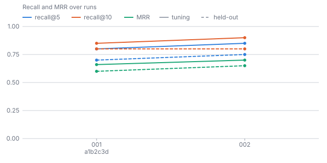

# kanon

`kanon` measures a retriever against a corpus, and keeps measuring it as both change.

> κανών: a measuring rod. The Alexandrian librarians used the word for their lists of the authors
> worth reading, the first canon. This tool is the rod, not the list.

## Why

Every retrieval system has a recall number somebody once computed and nobody can reproduce.
The query set lived in a notebook, the corpus has changed since, and the number was measured
over chunks the serving index never cut. So the system is tuned by feel, and a change that
helps one question and hurts three ships anyway.

`kanon` makes retrieval quality a file in git: a query set you commit, a run you can replay,
a gate that fails a pull request when recall drops, and a history that shows how the numbers
got where they are. It is retriever-agnostic. It scores the built-in reference index, an
embedding endpoint, or any search service that answers one HTTP request.

## Where it sits

```text
sources  ──►  pinakes   ──►  artifact + manifest  ──►  serapeum  ──►  agents
                                    │                       │
                              queries.jsonl             trail.jsonl
                                    │                       │
                                    └──────►  kanon  ◄──────┘
```

- [pinakes](https://github.com/friedrichwilken/pinakes) compiles a curated corpus.
- `kanon` measures any retriever against it.
- serapeum serves it. It implements the backend contract, so `kanon` can score what is actually
  running.

Each one reads and writes plain files. None needs the others at runtime. The shapes that cross
these lines (the backend request and response, a trail line, a retrieval unit) are versioned
and documented in [docs/manual/contracts.md](docs/manual/contracts.md), with a JSON Schema per
contract under [docs/schemas/](docs/schemas/).

## Status

Pre-release. The evaluation commands (`eval`, `embed`, `grade`, `queries`, `report`) have
moved here out of `pinakes`, where they started, with the same flags and file formats;
`history` is new here. See the [issues](https://github.com/friedrichwilken/kanon/issues) for
what comes next.

## Quick start

```sh
cargo install --git https://github.com/friedrichwilken/kanon --locked
kanon eval --artifact ./artifact --queries queries.jsonl
```

`eval` prints one table per split on stderr and the result as JSON on stdout:

```text
./artifact: 33 pages, 30 searchable, k = 10
| split | kind | n | recall@5 | recall@10 | MRR | nDCG@5 | nDCG@10 |
|---|---|---|---|---|---|---|---|
| tuning | overall | 12 | 0.917 | 0.917 | 0.917 | 0.902 | 0.910 |
| held-out | overall | 2 | 1.000 | 1.000 | 1.000 | 1.000 | 1.000 |
tuning: 1 negative queries, 1 rejected (1.000)
```

A `kanon.yaml` next to the artifact fixes what a bare `kanon eval` measures; a `pinakes.yaml`
with an `eval:` block works as before. `eval --json baseline.json` records a run,
`eval --gate baseline.json` exits 2 when the gated tuning metric drops by more than
`max_recall_drop` (recall@5 unless `--gate-metric` or the config's `gate_metric` names
`recall10`, `mrr`, `ndcg5` or `ndcg10`; the tolerance applies to whichever metric is gated;
a baseline written before nDCG existed has no value for it, so gating on `ndcg5` or `ndcg10`
against one warns and compares against 0 until the baseline is re-recorded), and
`eval --compare bm25,bm25-tantivy,dense,hybrid,external` scores several retrievers over
the same query set. `grade --backend NAME` takes the same backend flags and config defaults,
so a trail from a served retriever is graded on the candidates that retriever returns. Model
endpoints come from `KANON_EMBED_URL` and `KANON_LLM_URL` (the `PINAKES_*` names still
work).

`expected` is the binary judgement recall and MRR read. A row may add `graded`, the same kind
of keys with a relevance of 0 to 3, and nDCG@5 and nDCG@10 read that:

```json
{"id": "tls-port", "query": "which port does TLS use", "expected": ["handbook::docs/configuration.md"], "graded": {"handbook::docs/configuration.md": 3, "handbook::docs/reference/config-keys.md": 2}}
```

A row without `graded` scores every expected page at 1, so nDCG is still there, just binary;
`queries import` fills `graded` with every candidate's grade from `kanon grade`. A row with
`kind: "negative"` and an empty `expected` says the corpus does not answer the query. `eval`
keeps those rows out of every average and reports instead how many the retriever rejected: no
hit at all, or, with `--negative-threshold` (config `negative_threshold`), a top score under
it. `queries add --kind negative` appends one without `--expected`. `queries check` accepts an
empty `expected` only on such a row (it used to accept one on any row; every other kind now
exits 4), and fails on a negative row that names pages, a grade above 3 or a `graded` key that
names no page.

`eval --out runs/` also writes the result as `runs/NNN-<label>.json`, numbered after the last
run in the directory and labelled with `--label` or the git short SHA, with the backend, the
manifest and query-set hashes and the time inside. `kanon history` lists those runs as a
Markdown table (`--json OUT` for the rows as JSON), and `report --runs runs/` adds the same
table as a History section. Commit the directory and the numbers have a series.

`report --svg DIR` also writes the facts that decide a review as charts, linked from the
report: recall, MRR and nDCG@5 over the runs (tuning solid, held-out dashed), the rank of each
query's first expected hit before and after, and recall@5 per kind with tuning next to
held-out. Hand-rolled SVG, so GitHub renders it inline anywhere the files are committed.



No query set yet? `kanon queries suggest --n 50` samples pages across every source and section,
asks the model at `KANON_LLM_URL` for two or three questions each page answers, and writes them
to `suggestions.jsonl` with the page as the expected id. It never touches `queries.jsonl`: read
the file, then `kanon queries add --from suggestions.jsonl --accept ID...` (or `--accept-all`)
appends the rows you want, checked against the manifest like any other row. Suggestions that
quote the page title are dropped before you see them, and the accepted rows keep
`"origin": "suggested"`, so `eval`'s per-query rows tell generated queries from real ones.

## Gate a pull request

The reusable workflow `friedrichwilken/kanon/.github/workflows/eval.yml@main` runs
`eval --gate` on every pull request, writes the before/after report as the job summary and as
one comment, and with `commit_run: true` commits the run file (and a passing baseline) on the
default branch; the job exits 0, 2 or 1 like `eval`. It measures the reference index, or a
deployed service with `backend: external` and a `backend_url`. `uses: friedrichwilken/kanon@main`
installs the binary alone. Both are in [docs/manual/ci.md](docs/manual/ci.md).

## Licence

Apache-2.0.
